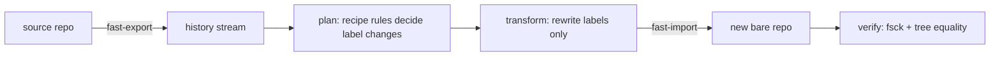

# gitforgery

Rewrite git history's **metadata** — author/committer identities, timestamps, and commit messages — with a declarative, repeatable recipe.

Git deliberately lets anyone set these fields;`gitforgery` automates that surface honestly — and helps you understand what a rewrite can and cannot do.

[](LICENSE)
[](go.mod)
[](https://github.com/sauryagur/gitforgery/actions)
[](https://github.com/sauryagur/gitforgery/releases)

---

## What this is — and what it is not

Git history is a chain of commit objects. Each commit stores, alongside the file
snapshot and its parent pointer, a few labels: _author_ (who wrote it,and when),
_committer_ (who recorded it,and when), and the commit _message_. Git never
validates these labels — anyone can write any name, email, or date. `gitforgery`
rewrites those labels according to rules you write in a small YAML file.

**It is not** a content filter like `git filter-repo` — it leaves files, trees, and
blobs byte-for-byte untouched. It is not a general-purpose git client. And it cannot
forge signatures — any edit invalidates a commit's GPG/SSH signature, so signatures
are stripped by default (see [Safety](#safety--honesty)).

## Status: shipped vs. planned

| Area                                                         | Status                                               |
| ------------------------------------------------------------ | ---------------------------------------------------- |
| Declarative recipe rewrite (`apply` → new repo)              | **shipped** (today's README                          |
| `--in-place` rewriting + backup refs + `undo`                | planned ([DESIGN.md][design] §5.2                    |
| `plan` preview hash table                                    | planned                                              |
| `fabricate` (synthetic history from nothing)                 | planned ([DESIGN.md][design] §7                      |
| `audit` (forgery-residue scan)                               | planned ([DESIGN.md][design] §9                      |
| `re-sign` (re-sign after rewrite)                            | planned                                              |
| TUI                                                          | planned (Bubble Tea stack — see [DESIGN.md][design]) |
| `forge` (decompose one squashed commit into organic history) | planned ([DESIGN.md][design] §13                     |

The full architecture and milestone roadmap live in [DESIGN.md][design].

## When to reach for it

- **Scrub identities from old history** — e.g. replace a former employer's email domain across hundreds of commits before making a repository public (GDPR-style hygiene).
- **Normalize authorship** — map several personal emails onto one canonical author, or re-date a migrated repo's commits.
- **Prepare demo / teaching repositories** — de-personalized, deterministic history that reads cleanly.
- **Pre-1.0 honesty** — it works end-to-end on real repos today, but only in the
  safe "new bare repo" mode. Anything riskier — wait for planned `--in-place` +
  backup/undo flow (or simply keep working on a copy.).

## Install

**Requirements:** Go ≥ 1.25 (build), and the `git` CLI ≥ 2.45 at runtime
(the rewrite pipeline shells out to git's own `fast-export`/`fast-import`.

**From source (recommended for now):**

```sh
git clone https://github.com/sauryagur/gitforgery.git
cd gitforgery
make build            # -> ./bin/gitforgery
./bin/gitforgery version
```

**Go install:**

```sh
go install github.com/sauryagur/gitforgery@latest
```

See [Development](#development) for the full `make` target list.

## Quick start

The tl;dr of `apply`: **export the source history, apply your recipe, import
into a brand-new bare repo, verify nothing but labels changed.** The source repo is
never modified — today's only mode writes a _new_ bare repository to `--to`.

### 1. Write a recipe

```yaml
# recipe.yaml — rule-based metadata rewrite
range: "main~5..main" # git rev-list range, or "all" for everything reachable
strip_signatures: true # always true unless re-signing later (top-level option)
preserve_date_order: true # clamp so committer dates stay monotonic
match: # ordered; first matching rule wins per commit
  - when:
      author_email: "@oldcorp\\.com$" # regex; absent fields match anything
    set:
      author: "Ada Lovelace <ada@example.com>"
      author_date: "2020-01-01T10:00:00+00:00"
      committer_date: "author" # mirror the (rewritten) author date
      subject: "{{.Subject}}" # optional text/template rewrite
```

Selectors (`when:`: `sha`, `author`, `author_email`, `committer`, `committer_email`,
`subject`, `branch` — each a Go regex over the corresponding commit attribute; `set:`
replacements: `author`, `committer` (`"inherit"` mirrors the author), `author_date`,
`committer_date`, `subject`, `body`. Date values: RFC3339 literals, `now`, `author`,
`first±dur`, `prev±dur` (e.g. `first+4h`, `prev+1h`).

### 2. Run it

```sh
gitforgery apply --recipe recipe.yaml --repo /path/to/repo --to /tmp/cleaned.git --yes
```

Notes:

- `--repo` defaults to the current directory.
- `--to` must **not** already exist — apply refuses to clobber.
- `--yes` is required for every rewriting run, even the ones that only write a fresh
  repo — a deliberate consent gate. Review the recipe against the planned output first.
- `--signed-tags` selects annotated-tag handling: `strip` (default), `abort`,
  `verbatim`, `warn`, `warn-strip`.

### 3. Check the result

apply reports the range, old→new repo pair, per-commit counts (planned /
modified / cascaded / unchanged), and the verification result:

```
applied main~5..main
source: /path/to/repo -> target: /tmp/cleaned.git
commits: 34 planned, 28 modified, 6 cascaded, 0 unchanged
verified: fsck --full clean, tree objects untouched
```

Inspect freely — old history is untouched back at the source:

```sh
git -C /tmp/cleaned.git log --oneline --decorate
git -C /tmp/cleaned.git log --format='%h %an <%ae> %ad %s' --date=iso
git -C /tmp/cleaned.git fsck --full
```

## How it works (no git internals required)

Imagine git history as a chain of **boxes** (commits). Every box has three parts:

1. a **snapshot** of every file in the project (called the _tree_),
2. a **pointer** to the box before it (the _parent_),
3. a **label block**: who wrote it (_author_ — name, email, timestamp), who
   recorded it (_committer_), and the commit _message_.

Every box carries a **serial number** (_hash_) computed from _everything_ inside it —
including the parent pointer. That tiny fact drives everything:

- change any label → that box gets a new serial number;
- change a serial number → every later box that points to it must point elsewhere,
  and gets a new serial number too — the chain _cascades_ to the tip.

So rewriting history by hand is fiddly. `gitforgery` doesn't touch git's
internals at all — it rides git's **own freight pipeline**:

> `git fast-export` unpacks the whole repo into a flat manifest — one section per
> commit, labels written as plain readable lines. We edit those lines. Then
> `git fast-import` re-packs them into a fresh repo, assigning fresh serial numbers.
> The actual file contents ride along byte-for-byte, never reopened.



Stage by stage:

1. **Export** — `git fast-export` reads the source history into a plain-text
   stream (the manifest). Read-only.
2. **Plan** — your recipe's rules are matched against every commit, producing an
   exact list of label changes — nothing is applied yet. (A `plan` CLI preview is on the
   roadmap and will reuse this exact library.)
3. **Transform** — the stream's author/committer/date/subject/body lines are rewritten
   per the plan. Everything else — trees, blobs, parents, tags — passes through
   unchanged, byte-for-byte.
4. **Import** — `git fast-import` packs the edited stream into a brand-new bare
   repository. Git itself recomputes every serial number — later commits
   cascaded automatically, exactly as real git would.
5. **Verify** — `git fsck --full` confirms a sound object store, and every rewritten
   commit's _tree serial number_ is checked against its source commit's — equal
   trees are the proof that file contents are untouched: labels only, as promised.

Why this design: **the rewrite semantics are git's own**. The tool never re-implements
hashing, tree-walking, or merge logic — it edits labels and lets git re-pack. This
is the same transport `git filter-repo` uses, aimed at metadata rather than content.

## Safety & honesty

- **The source repo is never modified today.** `apply` writes a fresh bare repo to
  `--to`; in-place rewriting (with backup refs `refs/forgery/original`. CAS
  `update-ref` checks,and dirty-worktree refusal)is planned — see [DESIGN.md][design] §5.

- **Consent is required even for fresh-repo runs**: `--yes` gates every rewrite, and
  `--to` must not already exist.

- **Signatures cannot be forged.** A `gpgsig` signature covers the commit's bytes;any
  rewrite voids it. `apply` strips signatures by default; a future `re-sign` will
  let you re-sign with your own key (planned).
- **Rewrites leave fingerprints.** New serial numbers mean old objects float unreachable
  until `gc`, reflogs record the old tips,and stale signatures linger. That is
  detectable by design — a future `audit` command will scan for it ([DESIGN.md][design] §9.
- **Legit uses only.** Identity scrubbing, demo repos, teaching materials. The tool
  is explicit that deliberately misleading history is out of scope of its "honest
  automation" posture.

## Development

```
cmd/             cobra commands (apply, version)
internal/recipe  YAML recipe: parse + strict validation
internal/plan     match rules → per-commit planned edits; preview-hash canary
internal/stream    fast-export/import lexer, transform, emit
internal/exec      git CLI wrappers (export, import, fsck, rev-parse)
internal/apply     orchestration: export → plan → transform → import → verify
internal/gitx      go-git helpers (ident parsing, preview hashing)
internal/testrepo  in-memory fixture repos for tests
```

**make targets:** `build` (→ `bin/gitforgery`), `test`, `test-race`, `cover`, `vet`,
`lint` (golangci-lint), `fmt`/`fmt-fix`, `tidy`, `release`/`snapshot` (GoReleaser),
`clean`, `help`.

**Testing story:** end-to-end integration tests against real temp `git init` repos;
golden fixture recipes; a preview-hash canary that re-encodes planned commits in Go
and asserts they match what `fast-import` actually produces — catching any stream-
vocabulary drift between the two worlds.

Contributions welcome — open an issue became a feature request first, then a PR;
check [DESIGN.md][design] for the roadmap so your change fits the architecture.

## License

[MIT](LICENSE). Full design, rationale, etiquette,and roadmap: [DESIGN.md][design].

[design]: DESIGN.md
